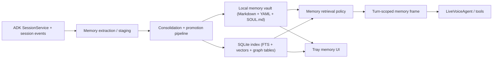

# Athena Memory V2

## Status

Design spec only. This document does not describe the current implementation; it describes the target memory architecture that should replace the current file-only reflection model.

## Why This Exists

Athena's current memory system works, but it has hard limits:

- Session-start memory is mostly frozen for the life of the socket.
- Semantic memory, episodic memory, and procedural memory are mixed together in a few files.
- "Forget" and "clear memory" are partial operations.
- Retrieval is prompt injection of a prebuilt bundle, not policy-driven memory access.
- There is no first-class provenance, approval model, or durable entity graph.
- The tray UI and backend do not read from a single coherent memory model.

The target system should preserve Athena's local-first character while making memory:

- dynamic
- inspectable
- scalable
- governable
- safer to evolve

## Goals

- Keep ADK sessions for short-term conversational continuity.
- Add a user-level memory system keyed by `user_id`, independent of any one session.
- Use local files as the human-inspectable source of truth.
- Use SQLite as the local index and retrieval engine.
- Support semantic, episodic, procedural, and reflective memory explicitly.
- Make time, provenance, approval state, and forgetting first-class.
- Keep prompt injection small by default and retrieve deeper context on demand.
- Support future graph-augmented memory without introducing a separate graph database on day one.
- Treat `SOUL.md` as a high-integrity identity document with controlled evolution.

## Non-Goals

- Replacing ADK `SessionService`.
- Building a cloud memory dependency.
- Storing every raw token of every conversation in the long-term memory layer.
- Automatically mutating Athena's identity from arbitrary content.

## High-Level Architecture



## Memory Taxonomy

### 1. Session memory

Owned by ADK.

- Raw conversation history
- Session state
- Resume / replay substrate
- Not the primary long-term memory format

### 2. Semantic memory

Authoritative structured user state.

Examples:

- name
- timezone
- role
- team
- active projects
- persistent preferences
- recurring constraints

Stored as structured YAML plus SQLite rows with provenance and recency metadata.

### 3. Episodic memory

Time-indexed summaries and notable events.

Examples:

- session summaries
- key decisions
- commitments made during a session
- important explanations or outcomes

Stored as Markdown episodes and indexed into SQLite.

### 4. Procedural memory

"How Athena should work with this user."

Examples:

- preferred writing style
- meeting-summary format
- decision-making habits
- recurring workflows

Stored as curated Markdown topic files plus structured policy metadata.

### 5. Reflective memory

Slow-changing distilled insights promoted from repeated evidence.

Examples:

- "User prefers direct summaries over brainstorming"
- "Roadmap work tends to slip unless a due date is made explicit"

Reflective memory is promoted only after consolidation, not written directly from a single turn.

### 6. Identity memory

Athena's own durable identity and relationship stance.

- `SOUL.md`
- pinned values
- boundaries
- tone
- controlled evolution patches

This is not user memory and must be stored separately from ordinary notes.

## Storage Model

Files are the source of truth. SQLite is the index.

### Vault layout

Proposed default root:

`~/.athena/memory/`

Proposed layout:

```text
~/.athena/memory/
├── identity/
│   ├── SOUL.md
│   └── soul_history/
│       └── 2026-03-12T120000Z.md
├── state/
│   ├── profile.yaml
│   ├── commitments.yaml
│   ├── preferences.yaml
│   └── procedures.yaml
├── notes/
│   ├── index.md
│   └── topics/
│       ├── work-style.md
│       ├── writing-preferences.md
│       └── relationships.md
├── episodes/
│   ├── 2026/
│   │   ├── 03/
│   │   │   ├── 2026-03-12-session-abc123.md
│   │   │   └── 2026-03-12-session-def456.md
├── staging/
│   ├── candidates/
│   │   └── 2026-03-12-session-abc123.json
│   └── review/
├── audit/
│   ├── memory_writes.jsonl
│   ├── memory_deletes.jsonl
│   └── soul_updates.jsonl
└── indexes/
    └── memory.db
```

### Why files remain the source of truth

- User can inspect and edit memory directly.
- Easy backup/export.
- Git-compatible if versioning is added later.
- Clear separation between durable memory and retrieval acceleration.

## SQLite Index

SQLite is the local retrieval engine, not the primary authoring surface.

### Requirements

- Single local file
- FTS5 for keyword/BM25 lookup
- vector index for semantic retrieval
- metadata filtering
- graph-like entity/edge tables
- deletion/tombstoning support

### Proposed SQLite schema

#### `memory_documents`

One row per durable vault document.

Fields:

- `document_id TEXT PRIMARY KEY`
- `namespace TEXT NOT NULL`
  - `identity`
  - `semantic`
  - `procedural`
  - `episodic`
  - `reflective`
- `path TEXT NOT NULL`
- `title TEXT NOT NULL`
- `source_type TEXT NOT NULL`
  - `profile`
  - `note`
  - `episode`
  - `soul`
  - `state`
- `created_at TEXT NOT NULL`
- `updated_at TEXT NOT NULL`
- `session_id TEXT`
- `user_id TEXT NOT NULL`
- `status TEXT NOT NULL`
  - `active`
  - `superseded`
  - `deleted`
- `approval_state TEXT NOT NULL`
  - `auto`
  - `pending_user`
  - `approved`
  - `rejected`
- `confidence REAL`
- `checksum TEXT`

#### `memory_chunks`

Chunked retrieval rows.

Fields:

- `chunk_id TEXT PRIMARY KEY`
- `document_id TEXT NOT NULL`
- `chunk_index INTEGER NOT NULL`
- `section TEXT`
- `chunk_text TEXT NOT NULL`
- `token_estimate INTEGER`
- `embedding BLOB`

FTS table:

- `memory_chunks_fts(chunk_text, section, title, keywords)`

#### `memory_facts`

Structured semantic state.

Fields:

- `fact_id TEXT PRIMARY KEY`
- `key TEXT NOT NULL`
- `value_json TEXT NOT NULL`
- `value_type TEXT NOT NULL`
- `namespace TEXT NOT NULL`
- `valid_from TEXT NOT NULL`
- `valid_to TEXT`
- `is_current INTEGER NOT NULL`
- `confidence REAL`
- `priority INTEGER NOT NULL DEFAULT 0`
- `source_document_id TEXT`
- `source_session_id TEXT`
- `approval_state TEXT NOT NULL`

Use this for authoritative state such as timezone, role, preferences, and active commitments.

#### `memory_entities`

Graph nodes.

Fields:

- `entity_id TEXT PRIMARY KEY`
- `entity_type TEXT NOT NULL`
  - `person`
  - `project`
  - `document`
  - `organization`
  - `topic`
  - `habit`
  - `preference`
- `canonical_name TEXT NOT NULL`
- `aliases_json TEXT NOT NULL`
- `metadata_json TEXT NOT NULL`
- `first_seen_at TEXT NOT NULL`
- `last_seen_at TEXT NOT NULL`

#### `memory_edges`

Graph edges.

Fields:

- `edge_id TEXT PRIMARY KEY`
- `from_entity_id TEXT NOT NULL`
- `edge_type TEXT NOT NULL`
- `to_entity_id TEXT NOT NULL`
- `weight REAL NOT NULL DEFAULT 1.0`
- `valid_from TEXT NOT NULL`
- `valid_to TEXT`
- `is_current INTEGER NOT NULL`
- `source_document_id TEXT`
- `source_session_id TEXT`

#### `memory_mutations`

Governance and audit trail.

Fields:

- `mutation_id TEXT PRIMARY KEY`
- `mutation_type TEXT NOT NULL`
  - `create`
  - `update`
  - `supersede`
  - `delete`
  - `approve`
  - `reject`
- `target_type TEXT NOT NULL`
- `target_id TEXT NOT NULL`
- `reason TEXT`
- `actor TEXT NOT NULL`
  - `system`
  - `user`
  - `reflection`
  - `review`
- `session_id TEXT`
- `created_at TEXT NOT NULL`
- `payload_json TEXT NOT NULL`

## Service Boundaries

### Keep

- `SessionManager`
- ADK `DatabaseSessionService`
- websocket turn lifecycle
- `ReflectionAgent` concept
- `IncrementalTapAgent` concept

### Replace / split

#### `MemoryService`

Current role:

- file I/O
- profile/session/ongoing/log management

Target role:

- thin vault I/O layer only
- no consolidation logic
- no retrieval policy

Split into:

- `memory/vault.py`
- `memory/store.py`
- `memory/audit.py`

#### `ContextBuilder`

Current role:

- assemble one static prompt bundle at session start

Target role:

- build compact pinned memory frame
- support turn-time retrieval overlays
- refresh session memory view after approved writes/deletes

Split into:

- `memory/read_policy.py`
- `memory/prompt_frame.py`

#### `IncrementalTapAgent`

Current role:

- extract notable items into `memory.log`

Target role:

- produce staged candidates only
- no direct durable writes except low-risk audit trail

#### `ReflectionAgent`

Current role:

- write session summary
- update profile
- update ongoing
- append reflection rows to log

Target role:

- consolidate staged candidates
- generate episodic summaries
- update semantic state tables
- promote procedural/reflective notes
- update graph nodes/edges
- update index

### New modules

Proposed package:

```text
app/memory/
├── __init__.py
├── models.py
├── vault.py
├── sqlite_index.py
├── graph_index.py
├── staging.py
├── consolidator.py
├── read_policy.py
├── prompt_frame.py
├── user_memory_service.py
├── approval.py
├── audit.py
└── deletion.py
```

## Target Read Path

### Default turn path

1. Load pinned identity kernel from `identity/SOUL.md`.
2. Load compact semantic state:
   - top profile facts
   - active commitments
   - stable preferences
3. Load small note index from `notes/index.md`.
4. Inject recent ADK session context.

This must stay small enough to include on every turn.

### Retrieval path

If the turn requires long-term memory:

1. Classify query intent:
   - semantic fact lookup
   - episodic recall
   - procedural guidance
   - relationship expansion
2. Run metadata prefilter:
   - namespace
   - recency
   - tags
   - entities
3. Run hybrid retrieval:
   - FTS
   - vector
   - optional recency boost
4. Expand graph neighborhood if needed.
5. Build a turn-scoped memory frame with:
   - authoritative state first
   - 1 to 5 relevant snippets
   - minimal provenance

### Refresh path

If memory changes during a live session:

- update the session-scoped memory frame
- do not wait for reconnect
- invalidate stale cached retrievals

This removes the current "session-start freeze" problem.

## Target Write Path

### Stage 1: candidate extraction

After meaningful turns, extract candidate memory items from:

- user utterance
- assistant response
- tool results
- explicit confirmations

Candidate types:

- `fact_candidate`
- `preference_candidate`
- `commitment_candidate`
- `procedure_candidate`
- `relationship_candidate`
- `reflective_candidate`

Candidate fields:

- `candidate_id`
- `user_id`
- `session_id`
- `turn_ref`
- `candidate_type`
- `payload`
- `confidence`
- `sensitivity`
- `approval_required`
- `entity_refs`
- `created_at`

Candidates are written to `staging/candidates/*.json` and optionally indexed in a lightweight staging table.

### Stage 2: consolidation

At idle boundary or session end:

1. Deduplicate candidates.
2. Merge with existing semantic state.
3. Decide whether to:
   - promote
   - supersede
   - reject
   - request approval
4. Generate episodic summary note.
5. Update graph nodes/edges.
6. Update SQLite FTS/vector indexes.
7. Append mutation audit rows.

### Stage 3: promotion rules

#### Semantic memory

Promote only when:

- durable across sessions
- user-specific
- not contradicted by newer approved state

#### Procedural memory

Promote only after repeated evidence or explicit user instruction.

#### Reflective memory

Promote only from repeated patterns or reflection pass.

#### Identity / SOUL changes

Never auto-promote.

- explicit user confirmation required
- diff must be generated
- audit record must be written

## SOUL.md Design

### File shape

`identity/SOUL.md`

Recommended structure:

1. Identity kernel
2. Tone and relationship stance
3. Boundaries
4. Stable working principles
5. Approved evolution layer

### Evolution policy

- all changes are patch-based
- every change gets a rationale and timestamp
- all changes are user-approved
- changes are written to `identity/soul_history/`
- rollback is supported by restoring a previous version

### Security rule

No external content may write directly to `SOUL.md`.

Only explicit user approval can move a suggestion into the identity namespace.

## Retrieval Policy

### Default injection budget

Always-on memory should remain tiny:

- SOUL excerpt
- compact profile
- active commitments
- compact note index

Everything else should be retrieved.

### Ranking policy

Base score should combine:

- namespace match
- entity match
- recency
- FTS rank
- vector similarity
- explicit pinning

Suggested merge:

- prefilter by namespace/entity/time
- rank by hybrid search
- expand one graph hop if useful
- cap final prompt snippets aggressively

## Forgetting and Deletion

Deletion must be deterministic and system-wide.

### `forget_fact(key)`

- tombstone or supersede row in `memory_facts`
- update source YAML
- remove or invalidate chunk rows
- update graph edges that depended on the fact
- write audit row
- refresh current session memory frame

### `clear_user_memory()`

Should clear:

- semantic state
- commitments
- note index
- topic notes
- episodic notes
- graph rows
- chunk/index rows
- memory mutation logs if requested

Should not clear by default:

- ADK session DB unless explicitly requested
- `SOUL.md` unless explicitly requested

This is intentionally stricter and more explicit than the current partial clear operation.

## Consent and Governance

### Approval levels

#### auto

Low-risk notes and episodic summaries.

#### soft-approval

Preferences and stable facts inferred with moderate confidence.

#### explicit approval

- sensitive personal data
- procedural rules with significant behavioral effect
- `SOUL.md` updates

### Required provenance

Every durable memory item must be attributable to:

- source session
- source turn or reflection pass
- creation time
- actor
- approval state

### Audit log

Every mutation should be recorded in both:

- SQLite `memory_mutations`
- `audit/*.jsonl`

## Tray / API Implications

### Backend API

Replace the current narrow memory routes with:

- `GET /memory/state`
- `GET /memory/notes`
- `GET /memory/episodes`
- `GET /memory/graph?entity=...`
- `POST /memory/forget`
- `POST /memory/approve`
- `POST /memory/reject`
- `POST /memory/clear`
- `GET /memory/audit`

### Tray UI

The tray should read from the backend memory service, not directly from ad hoc files.

Views:

- profile state
- active commitments
- recent episodes
- topic notes
- pending approvals
- audit trail
- clear/forget controls

This removes the current split-brain between tray disk reads and backend session memory.

## Migration Plan

### Phase 0: preserve current behavior

- keep current file locations readable
- add new memory package behind a feature flag

### Phase 1: introduce SQLite index

- index existing session summaries
- index profile and ongoing files
- add hybrid retrieval without changing write path yet

### Phase 2: add staged candidates

- `IncrementalTapAgent` writes candidates instead of raw memory log only
- `ReflectionAgent` reads from staging

### Phase 3: split semantic vs episodic state

- migrate `profile.yaml` into authoritative semantic state
- migrate `ongoing.md` into structured commitments

### Phase 4: add graph tables

- extract entities and relations during consolidation
- support one-hop retrieval expansion

### Phase 5: add `SOUL.md` governance

- move current persona seed into `identity/SOUL.md`
- add approval and version history

### Phase 6: retire old memory paths

- remove direct file-only context assembly
- remove obsolete routes and tray commands

## Current Code Mapping

### Keep mostly intact

- [session_manager.py](/Users/lmarte/Documents/Projects/Athena/athena/backend/adk-bidi/app/session_manager.py)
- [ws.py](/Users/lmarte/Documents/Projects/Athena/athena/backend/adk-bidi/app/ws.py)
- [ws_downstream.py](/Users/lmarte/Documents/Projects/Athena/athena/backend/adk-bidi/app/ws_downstream.py)

### Refactor heavily

- [memory_service.py](/Users/lmarte/Documents/Projects/Athena/athena/backend/adk-bidi/app/memory_service.py)
- [context_builder.py](/Users/lmarte/Documents/Projects/Athena/athena/backend/adk-bidi/app/context_builder.py)
- [tap_agent.py](/Users/lmarte/Documents/Projects/Athena/athena/backend/adk-bidi/app/tap_agent.py)
- [reflection_agent.py](/Users/lmarte/Documents/Projects/Athena/athena/backend/adk-bidi/app/reflection_agent.py)
- [routes/memory.py](/Users/lmarte/Documents/Projects/Athena/athena/backend/adk-bidi/app/routes/memory.py)

### Replace with new package

- ad hoc live context registry in `context_builder.py`
- partial clear / forget semantics
- file-only retrieval model

## Open Questions

- Should embeddings remain local-only, or is a cloud embedding fallback allowed?
- Should approval state live only in SQLite, or also in frontmatter for inspectability?
- Should note-topic files be user-editable directly, or be treated as generated outputs with diff review?
- Should `SOUL.md` live per device or per user account if Athena later syncs across devices?
- How aggressive should consolidation be for superseding old preferences?

## Recommended First Implementation Slice

The first worthwhile slice is:

1. Add `memory.db` with `memory_documents`, `memory_chunks`, `memory_facts`, and `memory_mutations`.
2. Keep current file outputs, but index them.
3. Add a new `UserMemoryService` read API.
4. Change `ContextBuilder` to build a compact memory frame from structured state + retrieved snippets instead of static file concatenation.
5. Change `IncrementalTapAgent` to write staged candidates.
6. Change `ReflectionAgent` to consolidate candidates into semantic state and episodic notes.

That sequence improves retrieval and correctness before the more ambitious graph and approval work lands.
